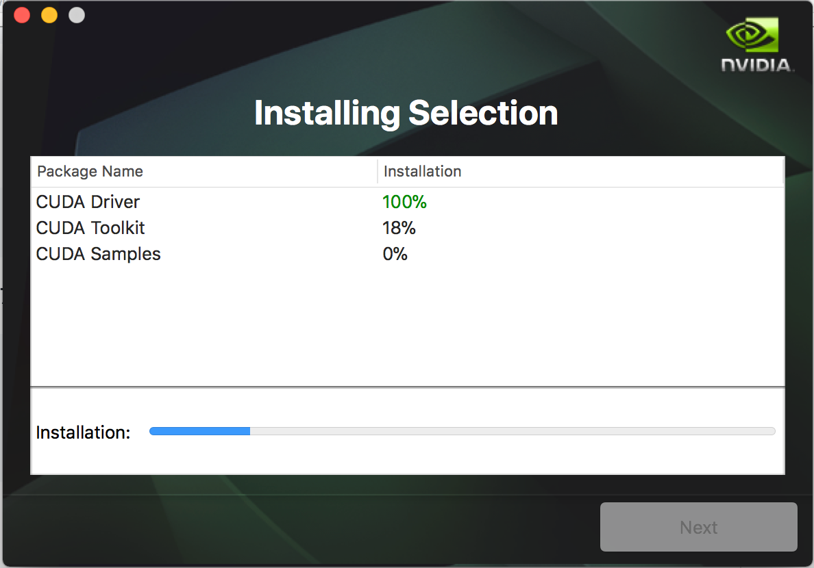
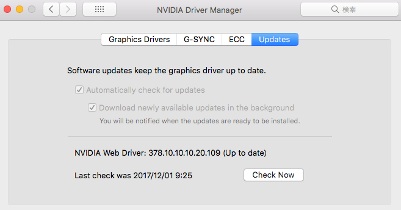
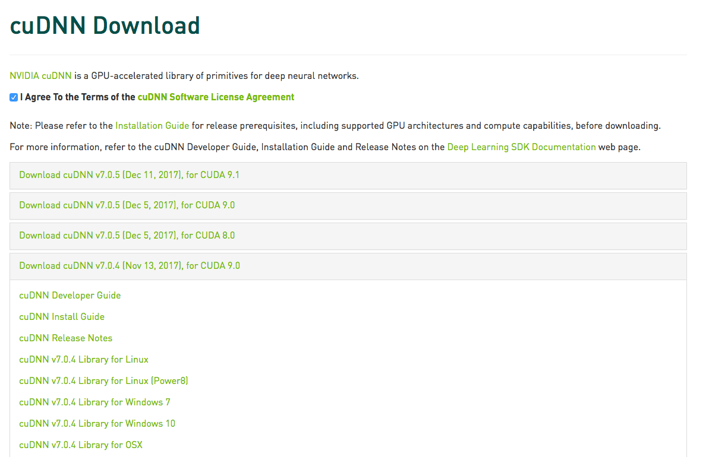
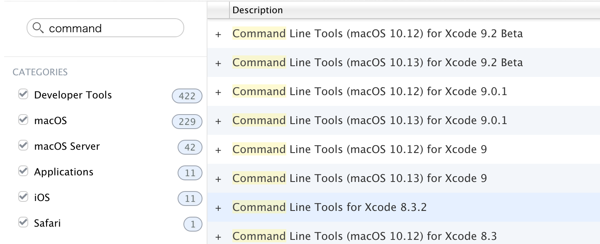
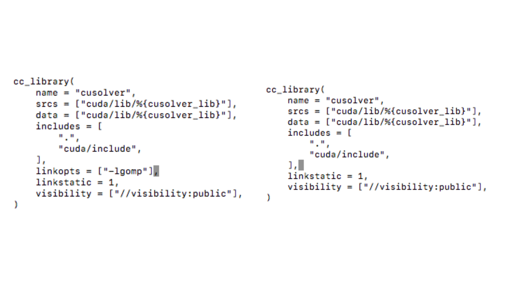

### HardWare

- MacBook Pro (Retina, 13-inch, Early 2015)
- eGFX Breakaway Box (eGPU Expansion System)
- NVIDIA GeForce 1060

## SoftWare

- MacOS10.13.1

- Nvidia Web Driver
- XcodeCommandLineTool 8.3.2
- cuda 9.0
- cudnn 7.0.4

- HomeBrew
- Bazel
- Anaconda

> I referred to the following description.<br/>
> https://gist.github.com/smitshilu/53cf9ff0fd6cdb64cca69a7e2827ed0f
> https://github.com/nathanielatom/tensorflow/releases/tag/v1.4.0-mac


## SIP

SIP is a recent Macintosh system integrity protection, which is responsible for the elimination of non-warranted drivers, and is changed by the method of entering from `csrutil` at the command prompt with Command + R booted up by Command + R Is possible. 

### WARNING

The following method will lower your security level.

### Execute.

After shutting down once, hold down "Command + R" and start up to enter Recovery mode.
Execute "csrutil disable" in recovery mode and start up again as usual.

## eGPU recognized

> Please try this.
> https://egpu.io/forums/mac-setup/wip-nvidia-egpu-support-for-high-sierra/

## Compile Tensorflow from source.

> Please also refer to this thread.
> https://github.com/tensorflow/tensorflow/issues/12052

### Install Anaconda

> https://anaconda.org

I'm Use Anaconda for Python environment.
Moreover, I use virtual environment.

We will build a Python virtual environment using the following code at terminal.

```
sudo conda create -n tensor_env python=3.6.3 anaconda
source activate tensor_env

# Install necessary packages.
sudo pip install six numpy wheel --upgrade
sudo pip install -U pip setuptools

# If it fails, remove the virtual environment.(To remove, comment out and execute the following)
# sudo conda remove -n tensor_env --all

```

### JDK

Install the JDK before installing HomeBrew.

> http://www.oracle.com/technetwork/java/javase/downloads/jdk8-downloads-2133151.html

### Install a Homebrew

> https://brew.sh

```commandline
/usr/bin/ruby -e "$(curl -fsSL https://raw.githubusercontent.com/Homebrew/install/master/install)"
```

## Will install various packages using HomeBrew.

```
brew update
brew upgrade

brew install coreutils
brew install swig
brew install bazel
```

### Install nvidia-cuda using HomeBrew.

It seems recently that in cask it was changed to nvidia-cuda instead of cuda.

```
brew tap caskroom/drivers
brew cask install nvidia-cuda
# Confirmation
brew cask info nvidia-cuda
```



#### After The Install

Installing CUDA using HomeBrew will install the old version.
Let's keep it up-to-date with System Preferences.



#### Sign in to Nvidia's website and download cuDNN.

> Nvidia Sign in.
> https://developer.nvidia.com/accelerated-computing-developer
> Download to cudnn.
> https://developer.nvidia.com/cudnn

##### use cuDNN version.

As of December 2017, the version of duDNN that can be used is up to 7.0.4.



After downloading, it thinks that something like `cudnn-9.0-osx-x64-v7.tgz` was downloaded, so decompress it.

I think the file has been decompressed as follows.

```
- cuda
- lib
- - libcudnn_static.a
- - libcudnn.dylib
- - libcudnn.7.dylib
- NVIDIA_SLA_cuDNN_Support
- include
- - cudnn.h
```

Copy the file as follows from Terminal.
It is assumed that it is downloaded to the "Downloads" folder.

```
sudo cp ~/Downloads/cuda/include/cudnn.h /usr/local/cuda/include/
sudo cp ~/Downloads/cuda/lib/libcudnn* /usr/local/cuda/lib/
```

### .bash_profile

Edit to ".bash_profile".
Please change {UserName} to your user name.

```
# That it will be created at the time of installation of Anaconda.

# added by Anaconda3 5.0.1 installer
export PATH="/Users/{UserName}/anaconda3/bin:$PATH"

# Add from here.

export CUDA_HOME=/usr/local/cuda
export DYLD_LIBRARY_PATH=/Users/{UserName}/lib:/usr/local/cuda/lib:/usr/local/cuda/extras/CUPTI/lib:/Developer/NVIDIA/CUDA-9.0/lib
export LD_LIBRARY_PATH=$DYLD_LIBRARY_PATH
export PATH=$DYLD_LIBRARY_PATH:$PATH

export PATH=/Developer/NVIDIA/CUDA-9.0/bin${PATH:+:${PATH}}
```

I'd like to System restart if possible, but I can respond by reloading ".bash_profile".

```commandline
source ~/.bash_profile
```

## compile

It takes a couple of hours in one compile.

### Install the Xdoce command line tools 

Install Xcode command line tools separately from Xcode.
Install version to 8.3.2 or 8.2.(9.X is not supported.)

> https://developer.apple.com/download/more/

But although software updates will prompt you to install the latest version of Xcode Command Line Tools, ignore them.



#### Change The Clang

```
# Current clang version.
/usr/bin/clang --version
# Change to installed command line tool.
sudo xcode-select -s /Library/Developer/CommandLineTools
# Confirm that the version has changed.
/usr/bin/clang --version
# Confirm path.
sudo xcode-select -p
# When restoring, execute as follows.
# sudo xcode-select -r
```

### Check the GPU Compute Capability.

Check the "Compute Capability" of the GPU to be used from the following URL.

> https://developer.nvidia.com/cuda-gpus

| GPU | Compute Capability |
|:---|:---|
|...|...|
| GeForce GTX 1060| 6.1 |
|...|...|

I use GTX 1060, so in this case "6.1" number is required.

### Git clone.

Use the "git clone" command.
I think that the `tensorflow` folder will be created in the working folder.

```
git clone https://github.com/tensorflow/tensorflow
cd tensorflow
git checkout r1.4
```

### Change The Code.

> https://gist.github.com/smitshilu/53cf9ff0fd6cdb64cca69a7e2827ed0f

Delete the description of `__align __ (sizeof (T))` for a specific file.
I think that it will be the number of lines as follows, line number may have been changed.

| File path | Line number |
| :--- | :--- |
|tensorflow/core/kernels/depthwise_conv_op_gpu.cu.cc|166|
| |436|
| |1054|
| |1313|
| tensorflow/core/kernels/split_lib_gpu.cu.cc |122|
| tensorflow/core/kernels/concat_lib_gpu.impl.cu.cc |72|

example...

```
extern __shared__ __align__(sizeof(T)) unsigned char shared_memory[];
```

to

```
extern __shared__ unsigned char shared_memory[];
```

### Further change the code.

> https://medium.com/@mattias.arro/installing-tensorflow-1-2-from-sources-with-gpu-support-on-macos-4f2c5cab8186

It seems that it does not correspond to a library of parallel thread called OpenMP, which causes the following error to be displayed, there are times when compilation does not pass.

```error
....
clang: warning: argument unused during compilation: '-pthread'
ld: library not found for -lgomp
clang: error: linker command failed with exit code 1 (use -v to see invocation)
Target //tensorflow/tools/pip_package:build_pip_package failed to build
Use --verbose_failures to see the command lines of failed build steps.
....
```

Back up to `(Tensorflow's Git clone destination)/third_party/gpus/cuda/BUILD.tpl`.
And 
Remove the following one line of the original file.
Perhaps it is listed on the line number 112.

```
linkopts = [“-lgomp”]
```



#### Caution

In the case of a virtual environment, packages in the root environment take precedence, so you should not install "Tensorflow" or "keras" in the root environment.
However, it is good when assuming use in the root environment.

### Symbolic link

Create a symbolic link to avoid errors.

```
sudo ln -s /usr/local/cuda/lib/libcuda.dylib /usr/local/cuda/lib/libcuda.1.dylib
# change {Username}
sudo ln /Users/{UserName}/anaconda3/lib/libgomp.1.dylib /usr/local/lib/libgomp.1.dylib
# Symbolic link cancellation method.
# unlink /usr/local/lib/libcuda.1.dylib
# unlink /usr/local/lib/libgomp.1.dylib

# nvcc -V
```

### configure

Please execute the following command on "tensorflow" folder created with "git clone ~".

```
./configure
```

If compilation fails, execute the following.

```
# Execute in case of failure.
bazel clean
```

If you run `. / configure`, you will be typing in question form.

For the question of 
`Please note that each additional compute capability significantly increases your build time and binary size. [Default is: 3.5,5.2]`
we will use "Compute Capability" earlier.

```
You have bazel 0.7.0-homebrew installed.
Please specify the location of python. [Default is /Users/XXX/anaconda3/envs/tensor_env/bin/python]: 


Found possible Python library paths:
  /Users/XXX/anaconda3/envs/tensor_env/lib/python3.6/site-packages
Please input the desired Python library path to use.  Default is [/Users/XXX/anaconda3/envs/tensor_env/lib/python3.6/site-packages]

Do you wish to build TensorFlow with Google Cloud Platform support? [Y/n]: n
No Google Cloud Platform support will be enabled for TensorFlow.

Do you wish to build TensorFlow with Hadoop File System support? [Y/n]: n
No Hadoop File System support will be enabled for TensorFlow.

Do you wish to build TensorFlow with Amazon S3 File System support? [Y/n]: n
No Amazon S3 File System support will be enabled for TensorFlow.

Do you wish to build TensorFlow with XLA JIT support? [y/N]: y
XLA JIT support will be enabled for TensorFlow.

Do you wish to build TensorFlow with GDR support? [y/N]: n
No GDR support will be enabled for TensorFlow.

Do you wish to build TensorFlow with VERBS support? [y/N]: n
No VERBS support will be enabled for TensorFlow.

Do you wish to build TensorFlow with OpenCL support? [y/N]: n
No OpenCL support will be enabled for TensorFlow.

Do you wish to build TensorFlow with CUDA support? [y/N]: y
CUDA support will be enabled for TensorFlow.

Please specify the CUDA SDK version you want to use, e.g. 7.0. [Leave empty to default to CUDA 8.0]: 9.0


Please specify the location where CUDA 9.0 toolkit is installed. Refer to README.md for more details. [Default is /usr/local/cuda]: 


Please specify the cuDNN version you want to use. [Leave empty to default to cuDNN 6.0]: 7


Please specify the location where cuDNN 7 library is installed. Refer to README.md for more details. [Default is /usr/local/cuda]:


Please specify a list of comma-separated Cuda compute capabilities you want to build with.
You can find the compute capability of your device at: https://developer.nvidia.com/cuda-gpus.
Please note that each additional compute capability significantly increases your build time and binary size. [Default is: 3.5,5.2]6.1


Do you want to use clang as CUDA compiler? [y/N]: n
nvcc will be used as CUDA compiler.

Please specify which gcc should be used by nvcc as the host compiler. [Default is /usr/bin/gcc]: 


Do you wish to build TensorFlow with MPI support? [y/N]: 
No MPI support will be enabled for TensorFlow.

Please specify optimization flags to use during compilation when bazel option "--config=opt" is specified [Default is -march=native]: 


Add "--config=mkl" to your bazel command to build with MKL support.
Please note that MKL on MacOS or windows is still not supported.
If you would like to use a local MKL instead of downloading, please set the environment variable "TF_MKL_ROOT" every time before build.
Configuration finished

```

### Build

```
bazel build --config=cuda --config=opt --action_env PATH --action_env LD_LIBRARY_PATH --action_env DYLD_LIBRARY_PATH //tensorflow/tools/pip_package:build_pip_package
```

#### to Create Package.

```
bazel-bin/tensorflow/tools/pip_package/build_pip_package /tmp/tensorflow_pkg
```

#### Install Package.

```
sudo pip install /tmp/tensorflow_pkg/tensorflow-1.4.1-cp36-cp36m-macosx_10_7_x86_64.whl
```

or

```
# Disable the cache and reinstall.
sudo pip --no-cache-dir install -I /tmp/tensorflow_pkg/tensorflow-1.4.1-cp36-cp36m-macosx_10_7_x86_64.whl
```

#### keras

Install "keras" if necessary.

```
sudo pip install keras --upgrade
```

> https://gist.github.com/smitshilu/53cf9ff0fd6cdb64cca69a7e2827ed0f

When I ran the test script in my environment, I got the following result.

```commandline
/Users/XXX/anaconda3/envs/tensor_env/bin/python /Users/XXX/python/projects/Projects/main.py
Using TensorFlow backend.
2017-11-27 17:40:08.986765: I tensorflow/core/platform/cpu_feature_guard.cc:137] Your CPU supports instructions that this TensorFlow binary was not compiled to use: AVX2 FMA
2017-11-27 17:40:09.250666: I tensorflow/stream_executor/cuda/cuda_gpu_executor.cc:856] OS X does not support NUMA - returning NUMA node zero
2017-11-27 17:40:09.252086: I tensorflow/core/common_runtime/gpu/gpu_device.cc:1030] Found device 0 with properties: 
name: GeForce GTX 1060 6GB major: 6 minor: 1 memoryClockRate(GHz): 1.759
pciBusID: 0000:c3:00.0
totalMemory: 6.00GiB freeMemory: 5.49GiB
2017-11-27 17:40:09.252127: I tensorflow/core/common_runtime/gpu/gpu_device.cc:1120] Creating TensorFlow device (/device:GPU:0) -> (device: 0, name: GeForce GTX 1060 6GB, pci bus id: 0000:c3:00.0, compute capability: 6.1)
/Users/XXX/python.py:154: UserWarning: Update your `Model` call to the Keras 2 API: `Model(inputs=Tensor("in..., outputs=Tensor("de...)`
  model = Model(input=inputs, output=predictions)
Train on 351 samples, validate on 50 samples
Epoch 1/10

  8/351 [..............................] - ETA: 3:36 - loss: 0.7039 - acc: 0.5000
 48/351 [===>..........................] - ETA: 32s - loss: 0.6816 - acc: 0.6250 
 96/351 [=======>......................] - ETA: 13s - loss: 0.6604 - acc: 0.6354
152/351 [===========>..................] - ETA: 6s - loss: 0.6430 - acc: 0.6776 
........
```

My English isn't so good so feel free to ask me if there is anything unclear.
Thank you.